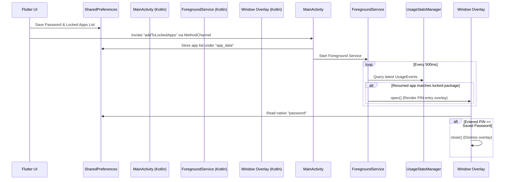

# Project Audit & Technical Summary Report: AppLockFlutter

This report provides a comprehensive review of the **AppLockFlutter** codebase, detailing the project architecture, module structure, package dependencies (including deprecated/discontinued ones), compatibility warnings, and critical bugs identified during the analysis.

---

## 1. Project Overview & Architecture

**AppLockFlutter** is an Android-only application built using Flutter that allows users to lock system applications behind a passcode. The app uses a hybrid architecture combining Flutter for UI/configuration and Native Android APIs (Kotlin/Java) for the background blocking engine.

### Tech Stack
*   **Frontend**: Flutter (Dart)
*   **State Management**: GetX (`package:get`)
*   **Persistence**: SharedPreferences (`package:shared_preferences`)
*   **Native Communication**: Flutter `MethodChannel` (`flutter.native/helper`)
*   **Native Locking UI**: Custom system overlay window using the Android `WindowManager` and `com.andrognito.pinlockview`.

### System Flow


---

## 2. Directory & Module Structure

Below is an overview of the key modules in this codebase:

### Flutter codebase (`/lib`)
*   **[main.dart](file:///C:/Users/mohit/OneDrive/Desktop/AppLockFlutter/lib/main.dart)**: Entry point of the app. Initializes global navigator keys and theme, and boots up the `SplashPage`.
*   **`/services`**:
    *   **[init.dart](file:///C:/Users/mohit/OneDrive/Desktop/AppLockFlutter/lib/services/init.dart)**: Handles dependency injection using GetX (registers controllers and SharedPreferences).
    *   **[constant.dart](file:///C:/Users/mohit/OneDrive/Desktop/AppLockFlutter/lib/services/constant.dart)**: Defines app constants, UI themes, font helpers (`GoogleFonts.epilogue`), and global helpers (url launching, date formatting).
    *   **[themes.dart](file:///C:/Users/mohit/OneDrive/Desktop/AppLockFlutter/lib/services/themes.dart)**: Contains the light/dark `ThemeData` configuration.
    *   **[extra_methods.dart](file:///C:/Users/mohit/OneDrive/Desktop/AppLockFlutter/lib/services/extra_methods.dart)**: Contains utility methods, many of which duplicate code from `constant.dart`.
*   **`/executables`**:
    *   **`/controllers`**:
        *   **[apps_controller.dart](file:///C:/Users/mohit/OneDrive/Desktop/AppLockFlutter/lib/executables/controllers/apps_controller.dart)**: Fetches installed applications using `device_apps`, manages lists of locked/unlocked applications, handles searching, and persists choices in SharedPreferences.
        *   **[method_channel_controller.dart](file:///C:/Users/mohit/OneDrive/Desktop/AppLockFlutter/lib/executables/controllers/method_channel_controller.dart)**: Manages communication with native Android (requests overlay, usage stats, and notification permissions).
        *   **[password_controller.dart](file:///C:/Users/mohit/OneDrive/Desktop/AppLockFlutter/lib/executables/controllers/password_controller.dart)**: Formats, validates, and saves the 6-digit passcode.
        *   **[permission_controller.dart](file:///C:/Users/mohit/OneDrive/Desktop/AppLockFlutter/lib/executables/controllers/permission_controller.dart)**: Helper controller for triggering OS-level permission prompts.
        *   **[service_controller.dart](file:///C:/Users/mohit/OneDrive/Desktop/AppLockFlutter/lib/executables/controllers/service_controller.dart)**: Contains date picker, time picker, and API call utilities.
        *   **[home_screen_controller.dart](file:///C:/Users/mohit/OneDrive/Desktop/AppLockFlutter/lib/executables/controllers/home_screen_controller.dart)**: Manages page views on the primary home screen.
    *   **`/repositories`**:
        *   **[auth_repo.dart](file:///C:/Users/mohit/OneDrive/Desktop/AppLockFlutter/lib/executables/repositories/auth_repo.dart)**: Simple repository to get/set authorization token.
*   **`/models`**:
        *   **[application_model.dart](file:///C:/Users/mohit/OneDrive/Desktop/AppLockFlutter/lib/models/application_model.dart)**: Data models (`ApplicationDataModel`, `ApplicationData`) for application objects stored in local preferences.
*   **`/screens`**:
    *   **[splash.dart](file:///C:/Users/mohit/OneDrive/Desktop/AppLockFlutter/lib/screens/splash.dart)**: Renders logo, waits, and directs users to either set up a passcode or lock applications.
    *   **[set_passcode.dart](file:///C:/Users/mohit/OneDrive/Desktop/AppLockFlutter/lib/screens/set_passcode.dart)**: Page for setting up or updating the passcode lock.
    *   **[unlocked_apps.dart](file:///C:/Users/mohit/OneDrive/Desktop/AppLockFlutter/lib/screens/unlocked_apps.dart)**: Main UI listing installed applications with switches to lock/unlock them.
    *   **[search.dart](file:///C:/Users/mohit/OneDrive/Desktop/AppLockFlutter/lib/screens/search.dart)**: Search page allowing fast lookup of apps to toggle locks.
*   **`/widgets`**:
    *   Re-usable components like dialogs: `confirmation_dialog.dart`, `custom_dialog.dart`, `ask_permission_dialog.dart`, `pass_confirm_dialog.dart`.

### Native Codebase (`/android/app/src/main`)
*   **[MainActivity.kt](file:///C:/Users/mohit/OneDrive/Desktop/AppLockFlutter/android/app/src/main/kotlin/com/applockFlutter/MainActivity.kt)**: The entry point activity. Mounts the flutter engine and sets up MethodChannel handler routes for permission checks, settings intent routing, and background service commands.
*   **[ForegroundService.kt](file:///C:/Users/mohit/OneDrive/Desktop/AppLockFlutter/android/app/src/main/java/com/appmanager/etherium/switch_up/ForegroundService.kt)**: Starts a persistent background service. Queries `UsageStatsManager` every 500ms to monitor active foreground apps.
*   **[Window.kt](file:///C:/Users/mohit/OneDrive/Desktop/AppLockFlutter/android/app/src/main/java/com/appmanager/etherium/switch_up/Window.kt)**: Constructs the overlay lock overlay layout (`R.layout.pin_activity`) and controls displaying/dismissing it.
*   **[BootUpReceiver.kt](file:///C:/Users/mohit/OneDrive/Desktop/AppLockFlutter/android/app/src/main/java/com/appmanager/etherium/switch_up/BootUpReceiver.kt)**: Broadcast receiver listening for `BOOT_COMPLETED` events to launch the locking service when the phone restarts.
*   **[HomeWatcher.kt](file:///C:/Users/mohit/OneDrive/Desktop/AppLockFlutter/android/app/src/main/java/com/appmanager/etherium/switch_up/HomeWatcher.kt)**: Broadcast receiver that tracks home button presses to shut down overlays.

---

## 3. Package Dependencies Analysis

### Deprecated or Discontinued Packages
1.  **`device_apps: ^2.2.0` (Discontinued)**
    *   **Usage**: Used in `lib/executables/controllers/apps_controller.dart` to fetch installed apps.
    *   **Status**: Marked as **discontinued** on pub.dev. It has not received updates in years and does not fully support modern Android permission structures.
    *   **Alternative**: Migrate fully to **`installed_apps`** (which is already declared in `pubspec.yaml` but unused!).
2.  **`js: ^0.7.1` (Discontinued)**
    *   **Usage**: Pulled in transitively.
    *   **Status**: Discontinued; replaced by new Dart JS interop libraries in Dart 3.
3.  **`flutter_switch: ^0.3.2` (Unmaintained)**
    *   **Usage**: Custom switch toggles in `lib/screens/unlocked_apps.dart` and `lib/screens/search.dart`.
    *   **Status**: Deprecated/unmaintained since 2021.
    *   **Alternative**: Use standard `Switch` or custom animated container.
4.  **`flutter_inappwebview: ^5.4.3+7` (Outdated)**
    *   **Status**: 5.x version has issues on newer Gradle/Kotlin environments.
    *   **Alternative**: Update to the modern version `6.1.5` or later.

---

## 4. Code Issues & Compatibility Warnings

Here are key compatibility problems and code quality issues identified in the codebase:

### A. Flutter/Dart Compatibility Issues (Flutter 3.x Upgrade blockers)

1.  **Dart SDK Constraint Mismatch**
    *   **Location**: [pubspec.yaml](file:///C:/Users/mohit/OneDrive/Desktop/AppLockFlutter/pubspec.yaml#L19-L21)
    *   **Issue**: `sdk: ">=2.16.2 <3.0.0"`.
    *   **Impact**: Today's Flutter environments (Flutter 3.x+) require Dart 3.x. The current configuration restricts compiled builds to Dart 2.x and will fail to compile on standard modern Flutter SDK setups.
2.  **WillPopScope Deprecation**
    *   **Locations**:
        *   [unlocked_apps.dart:L25](file:///C:/Users/mohit/OneDrive/Desktop/AppLockFlutter/lib/screens/unlocked_apps.dart#L25)
        *   [set_passcode.dart:L24](file:///C:/Users/mohit/OneDrive/Desktop/AppLockFlutter/lib/screens/set_passcode.dart#L24)
    *   **Issue**: `WillPopScope` is deprecated in Flutter 3.12+ and can cause unexpected back-navigation bugs.
    *   **Fix**: Replace with the modern `PopScope` widget.
3.  **Legacy TextTheme & Theme Colors Deprecation**
    *   **Locations**: [themes.dart](file:///C:/Users/mohit/OneDrive/Desktop/AppLockFlutter/lib/services/themes.dart#L54-L83) and throughout screens.
    *   **Issue**: Uses legacy typography properties like `bodyText1`, `bodyText2`, and `subtitle1` which are deprecated in Flutter 3.10+. `Theme.of(context).backgroundColor` is also deprecated.
    *   **Fix**: Update `themes.dart` to use `bodyLarge`, `bodyMedium`, and `titleMedium`, and replace `.backgroundColor` with `.colorScheme.background`.
4.  **Deprecated URL Launcher Methods**
    *   **Locations**: [constant.dart](file:///C:/Users/mohit/OneDrive/Desktop/AppLockFlutter/lib/services/constant.dart#L58-L88) and [extra_methods.dart](file:///C:/Users/mohit/OneDrive/Desktop/AppLockFlutter/lib/services/extra_methods.dart#L28-L56)
    *   **Issue**: Uses `canLaunch` and `launch` which are deprecated in newer versions of the `url_launcher` package.
    *   **Fix**: Migrate to `canLaunchUrl` and `launchUrl` using `Uri` values.

---

### B. Native Android Compatibility Issues (Android 12/14+ Crash Risks)

1.  **Android 14+ Foreground Service Crash**
    *   **Location**: [AndroidManifest.xml:L52](file:///C:/Users/mohit/OneDrive/Desktop/AppLockFlutter/android/app/src/main/AndroidManifest.xml#L52)
    *   **Issue**: The foreground service `<service android:name=".ForegroundService"/>` lacks an explicit type definition.
    *   **Impact**: In Android 14+ (API level 34+), foreground services must declare a `foregroundServiceType` attribute in the manifest. If targetSdkVersion is updated, this service will crash the app on startup.
    *   **Fix**: Add `android:foregroundServiceType="specialUse"` (or relevant type) to the service declaration.
2.  **Home Button Receiver Restriction (Android 12+)**
    *   **Location**: [HomeWatcher.kt](file:///C:/Users/mohit/OneDrive/Desktop/AppLockFlutter/android/app/src/main/java/com/appmanager/etherium/switch_up/HomeWatcher.kt)
    *   **Issue**: Tracks home presses by intercepting the `Intent.ACTION_CLOSE_SYSTEM_DIALOGS` broadcast.
    *   **Impact**: In Android 12 (API level 31) and higher, Google blocked background services and apps from receiving this action for security reasons. On modern devices, the system overlay will fail to detect when the user presses "Home" or "Recents," leaving the lock screen stuck or broken.
3.  **BootUpReceiver Service Launch Crash (Android 8+)**
    *   **Location**: [BootUpReceiver.kt:L12](file:///C:/Users/mohit/OneDrive/Desktop/AppLockFlutter/android/app/src/main/java/com/appmanager/etherium/switch_up/BootUpReceiver.kt#L12)
    *   **Issue**: Calls `context.startService(...)` to spin up the foreground service when the phone restarts.
    *   **Impact**: Starting services using `context.startService` from the background (e.g. at device startup) throws an `IllegalStateException` on Android 8.0+.
    *   **Fix**: Modify to `ContextCompat.startForegroundService(context, intent)`.

---

### C. Logic Bugs & Redundant Code

1.  **CRITICAL BUG: App Icon Corruption in SharedPreferences**
    *   **Location**: [application_model.dart:L63-L109](file:///C:/Users/mohit/OneDrive/Desktop/AppLockFlutter/lib/models/application_model.dart#L63-L109)
    *   **Issue**: When saving/reading locked apps, the `icon` field (which is raw binary `Uint8List`) is converted to JSON by performing:
        ```dart
        // serialization (toJson)
        base64Encode(Uint8List.fromList(utf8.encode(icon.toString())))

        // deserialization (fromJson)
        List<int> list = utf8.encode(data.toString());
        return Uint8List.fromList(list);
        ```
    *   **Impact**: `icon.toString()` outputs the string representation of array elements (e.g., `"[1, 2, 3]"`). UTF-8 encoding this string produces the ASCII bytes representing square brackets and numbers, which are then base64 encoded. The actual image bytes are completely lost. When loaded from the cache, the icons will be broken or corrupted.
    *   **Fix**: Store/load binary data directly:
        *   In `toJson()`: `base64Encode(icon)`
        *   In `fromJson()`: `base64Decode(json["icon"])`
2.  **Broken and Unused Native Activity**
    *   **Location**: [PinCodeActivity.kt](file:///C:/Users/mohit/OneDrive/Desktop/AppLockFlutter/android/app/src/main/java/com/appmanager/etherium/switch_up/PinCodeActivity.kt)
    *   **Issue**: The `init` block of this class invokes `.attachIndicatorDots()` on an uninitialized null pointer `mPinLockView` (causing a crash). Luckily, it is never instantiated or launched (only the class `Window.kt` is actually used).
    *   **Fix**: Safe to delete `PinCodeActivity.kt` entirely.
3.  **Redundant Code Duplication**
    *   **Location**: [extra_methods.dart](file:///C:/Users/mohit/OneDrive/Desktop/AppLockFlutter/lib/services/extra_methods.dart)
    *   **Issue**: Contains identical copy-pasted implementations of methods defined in [constant.dart](file:///C:/Users/mohit/OneDrive/Desktop/AppLockFlutter/lib/services/constant.dart) (e.g., `getWhatsAppUrl`, `getCallUrl`, `getMailUrl`, `launchInBrowser`, `launchWebsite`, `getInitials`).
    *   **Fix**: Clean up and import helpers directly from `constant.dart`.
4.  **Unused Views & Configs**
    *   `NativeActivity.kt` and its XML layout `activity_native.xml` are declared but never used.
    *   `installed_apps` package is declared in `pubspec.yaml` but never imported or utilized.

---

## 5. Modernization & Remediation Roadmap

To fix these bugs and support current mobile environments, follow this prioritized checklist:

| Priority | Task | Location |
|---|---|---|
| **P0** (Crash Fix) | Replace `context.startService` with `ContextCompat.startForegroundService` | [BootUpReceiver.kt](file:///C:/Users/mohit/OneDrive/Desktop/AppLockFlutter/android/app/src/main/java/com/appmanager/etherium/switch_up/BootUpReceiver.kt) |
| **P0** (Data Bug) | Rewrite `Uint8List` JSON conversion in model to use direct base64 codecs | [application_model.dart](file:///C:/Users/mohit/OneDrive/Desktop/AppLockFlutter/lib/models/application_model.dart) |
| **P1** (Modernize) | Update Dart SDK range constraint to `sdk: ">=3.0.0 <4.0.0"` | [pubspec.yaml](file:///C:/Users/mohit/OneDrive/Desktop/AppLockFlutter/pubspec.yaml) |
| **P1** (Migration) | Replace deprecated `device_apps` with `installed_apps` | [apps_controller.dart](file:///C:/Users/mohit/OneDrive/Desktop/AppLockFlutter/lib/executables/controllers/apps_controller.dart) |
| **P1** (Android 14) | Add `foregroundServiceType` attribute in the manifest declaration | [AndroidManifest.xml](file:///C:/Users/mohit/OneDrive/Desktop/AppLockFlutter/android/app/src/main/AndroidManifest.xml) |
| **P2** (Cleanup) | Replace deprecated `WillPopScope` with `PopScope` | `unlocked_apps.dart`, `set_passcode.dart` |
| **P2** (Cleanup) | Update TextTheme and color scheme definitions | [themes.dart](file:///C:/Users/mohit/OneDrive/Desktop/AppLockFlutter/lib/services/themes.dart) |
| **P3** (Refactor) | Remove `extra_methods.dart`, `PinCodeActivity.kt`, and unused layout files | `/lib/services/`, `/android/...` |

---

## 6. Security Concerns & Vulnerabilities

During the static code analysis, several security design flaws and vulnerabilities were identified. These issues compromise the integrity of the App Lock utility:

### A. Plaintext Storage of Passcode (High Risk)
*   **Locations**:
    *   [apps_controller.dart:L45](file:///C:/Users/mohit/OneDrive/Desktop/AppLockFlutter/lib/executables/controllers/apps_controller.dart#L45)
    *   [MainActivity.kt:L42-L44](file:///C:/Users/mohit/OneDrive/Desktop/AppLockFlutter/android/app/src/main/kotlin/com/applockFlutter/MainActivity.kt#L42-L44)
*   **Issue**: The user's passcode is written as plain, unencrypted text to `SharedPreferences` in both the Flutter compartment (`AppConstants.setPassCode`) and the Android native side (`"password"` inside `"save_app_data"`).
*   **Risk**: Although standard shared preferences are sandboxed by the OS, they are stored in plaintext XML. On rooted devices, via backup exploits, or through debugging access, attackers can easily read the XML file and compromise the PIN.
*   **Remediation**: Use `flutter_secure_storage` (backed by KeyStore/Keychain) in Flutter, and encrypt values using `EncryptedSharedPreferences` on the Android native side.

### B. Weak Verification Logic & No Brute-Force Protection (Medium Risk)
*   **Location**: [Window.kt:L80-L87](file:///C:/Users/mohit/OneDrive/Desktop/AppLockFlutter/android/app/src/main/java/com/appmanager/etherium/switch_up/Window.kt#L80-L87)
*   **Issue**: Passcode verification uses string equality against the cleartext password (`pinCode == dta`). Additionally, there is no rate limiting, delay, or account-lockout logic.
*   **Risk**:
    1.  Lack of hashing makes reverse engineering and data dumps immediately catastrophic.
    2.  An attacker (or automated script) can brute-force the 6-digit passcode by spamming inputs continuously without any temporary lockout or cooldown.
*   **Remediation**:
    1.  Store only a cryptographic hash of the passcode (e.g., SHA-256 or PBKDF2) along with a salt.
    2.  Implement a lockout mechanism that disables inputs for 30+ seconds after 5 consecutive failed attempts.

### C. Plaintext MethodChannel Transmission (Low Risk)
*   **Location**: [method_channel_controller.dart:L76](file:///C:/Users/mohit/OneDrive/Desktop/AppLockFlutter/lib/executables/controllers/method_channel_controller.dart#L76)
*   **Issue**: The passcode is passed as cleartext over the Flutter-to-Native method channel (`setPasswordInNative`).
*   **Risk**: Sniffing the binary messenger in custom development builds or reverse-engineered runtimes can expose the passcode during transport.
*   **Remediation**: Encrypt the passcode before sending it over the MethodChannel.

### D. Exported Broadcast Receiver without Permissions (Low Risk)
*   **Location**: [AndroidManifest.xml:L40-L50](file:///C:/Users/mohit/OneDrive/Desktop/AppLockFlutter/android/app/src/main/AndroidManifest.xml#L40-L50)
*   **Issue**: The `BootUpReceiver` is declared as `android:exported="true"` but is not protected by any custom permissions.
*   **Risk**: Any malicious application co-located on the same device can send a spoofed broadcast to trigger this receiver directly, forcing the background locking service to restart/run unnecessarily.
*   **Remediation**: Set `android:exported="false"` if possible, or require a permission verification check.

### E. Over-Privileged Permissions (Low Risk)
*   **Location**: [AndroidManifest.xml:L11-L12](file:///C:/Users/mohit/OneDrive/Desktop/AppLockFlutter/android/app/src/main/AndroidManifest.xml#L11-L12)
*   **Issue**: The app requests `BLUETOOTH` and `BLUETOOTH_CONNECT` permissions.
*   **Risk**: An app lock application has no functional need for Bluetooth connectivity. Declaring unnecessary permissions violates the principle of least privilege and increases security audit scrutiny.
*   **Remediation**: Remove Bluetooth permissions from the manifest.

### F. Lack of Obfuscation / Decompilation Exposure (Low Risk)
*   **Issue**: There are no custom Proguard/R8 obfuscation rules configured for Android.
*   **Risk**: Decompiling the APK using utilities like JADX will yield clear, readable Kotlin source files showing exactly how app locks are bypassed and where SharedPreferences is accessed.
*   **Remediation**: Configure `proguard-rules.pro` to obfuscate class paths and variables in native Kotlin components.

